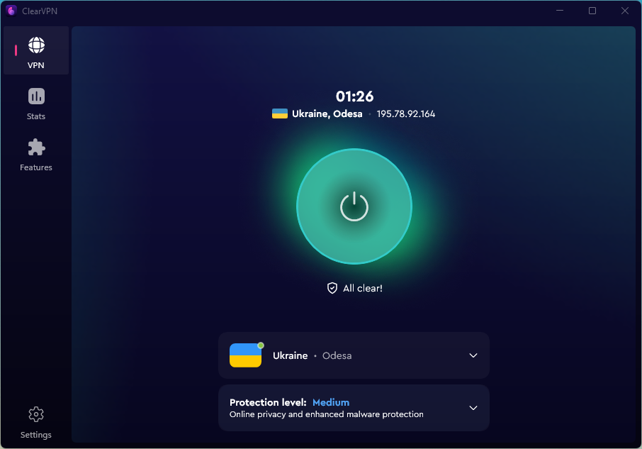

# Oleksii Kupriienko

👋 Hi, I'm Oleksii — a C#/.NET developer specializing in Windows desktop applications with over 13 years of experience.  
🧩 Specialized in building robust Windows desktop apps with modern UI (WinUI/WPF), VPN integration, networking, and secure deployment pipelines.

## 🪟 Main Project Contributions

### 🫧 ClearVPN for Windows

**Role:** Lead Windows Developer @ MacPaw (2019–2024 full-time, now part-time freelance)  
**Stack:** C#, .NET 6+, WinUI 3, GRPC, WireGuard, OpenVPN, IKEv2, Hysteria2, sing-box, WFP, WiX, CI/CD (GitHub Actions)  
**Achievements:**
- Designed and implemented the complete architecture of the ClearVPN Windows client from scratch

  

- Built an intuitive and dynamic WPF UI, later migrated to WinUI 3 with .NET 6+ to modernize the app and align with Microsoft’s roadmap
- Integrated multiple VPN protocols: OpenVPN 2.5, IKEv2, Hysteria2
- Implemented core features: split tunneling, killswitch, connection health tracking, auto-mode with smart protocol/server selection
- Enhanced protection for different user scenarios and needs

  

- Created a real-time dashboard with VPN usage statistics, speed tests, and performance insights

  

- Automated the full build-sign-package-release cycle using GitHub Actions and code signing
- Packaged the app using WiX
- Helped ClearVPN earn multiple industry awards, including the Red Dot Award and Cybersecurity Excellence Award

🔗 [clearvpn.com](https://clearvpn.com)

## 📁 Public Repositories Hightligts

### 🛰 grpc-single-app-instance-dotnet

**Purpose:** Enable single-instance behavior in modern .NET desktop apps using gRPC instead of WCF  
**Highlights:**
- Forwards command-line arguments from secondary to primary instance
- Designed for apps where WCF or named pipes are deprecated or unsupported
- Minimal, portable, dependency-free and compatible with .NET 6+ and future versions
- Used for migration Windows ClearVPN desktop client from .NET Framework 4.7.2 to modern .NET 6+   
🔗 [Repository](https://github.com/cuprumator/grpc-single-app-instance-dotnet)

### 🔄 AutoAppcast
**Purpose:** .NET tool for generating Sparkle-compatible appcast feeds for software update delivery  
**Highlights:**
- Produces XML appcast files with version info and DSA signatures
- Used to prepare update metadata for apps that integrate the Sparkle updater
- Runs as a command-line tool and can be integrated into Windows-based CI/CD pipelines
- Fully cross-platform thanks to .NET — tested and used on Windows   
🔗 [Repository](https://github.com/cuprumator/AutoAppcast)

## 💼 Additional Experience

### 🛡 Apriorit (2015–2019)
- Developed and maintained secure remote desktop features with focus on encrypted communication
- Built a security monitoring service to detect and respond to system-level events
- Created CUDA-powered high-performance image processing apps for internal tools
- Designed and implemented tools for Windows CA certificate and driver management
- Ported key Node.js/TypeScript tools from Windows to macOS

### 🏗 Allbau Software (2011–2015)
- Built plugins and extension modules for Allplan CAD system
- Developed a custom CAD data type conversion engine to bridge different architecture tools

## 🚧 Under Construction

### 🧭 Subscription Calculator (Pet Project, in progress)

A fullstack web app for tracking subscriptions with auto-renewal logic, multi-user support, and mobile-friendly design.

**Tech:** ASP.NET Core Minimal API, Entity Framework, PostgreSQL, TypeScript, React (future), GitHub Actions, Docker  
**Key features (planned):**
- Manage subscriptions, costs, reminders
- Multi-platform UI (Web, iOS/Android later)
- Real-time validation and budget analytics  
## 🔧 Skills 

**Languages:**  
C#, C++, XAML

**Frameworks:**  
.NET 6+, .NET Framework 4+, WPF, WinUI, gRPC, STL

**Tools & Technologies:**  
Visual Studio, VS Code, CMake, Git, WiX Installer, InnoSetup, MSTest, GoogleTest, NAnt, Bamboo CI/CD

**Engineering Principles & Architecture:**  
MVVM, OOP, SOLID, Refactoring, Dependency Injection, TDD

**Other:**  
REST, JSON, XML, Windows Filtering Platform (WFP), VPN Protocols (OpenVPN, IKEv2, Hysteria2), CI/CD

**Domains:**  
- Windows desktop application development  
- VPN protocols (OpenVPN, WireGuard, IKEv2, Hysteria2), connection management  
- Interprocess communication (gRPC, CLI args, Windows messages)  
- Deployment automation, code signing, CI/CD pipelines  
- System-level Windows dev: WinAPI, COM, WFP  
- Performance optimization, security design, diagnostics dashboards

## 📫 Let’s connect

📧 oleksii.kupriienko@gmail.com  
🔗 [LinkedIn](https://www.linkedin.com/in/kupriienko/)
